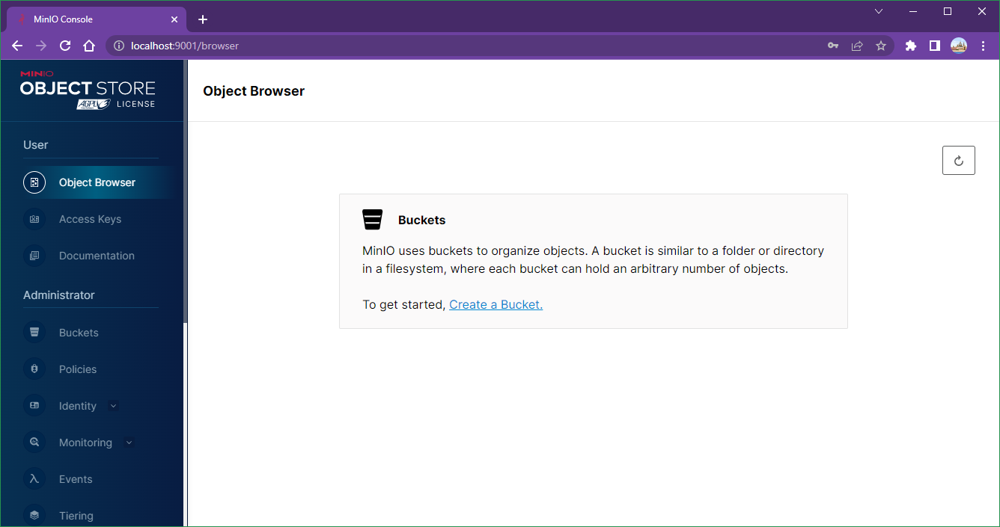
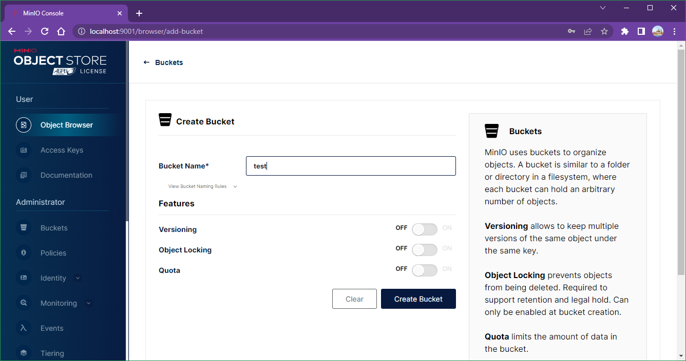
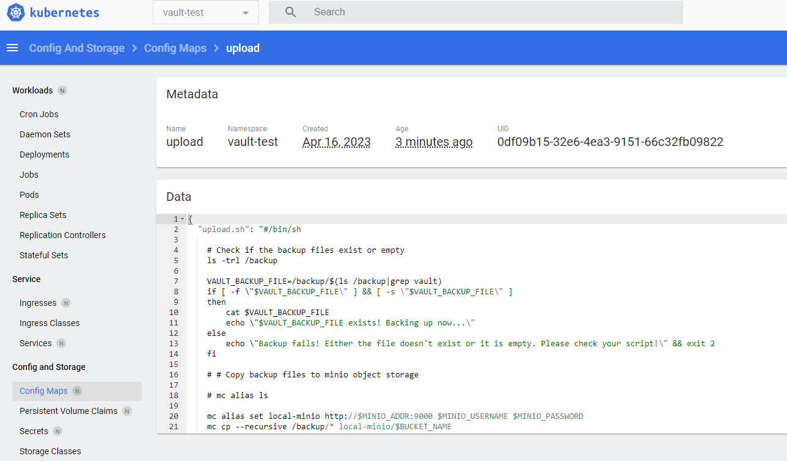
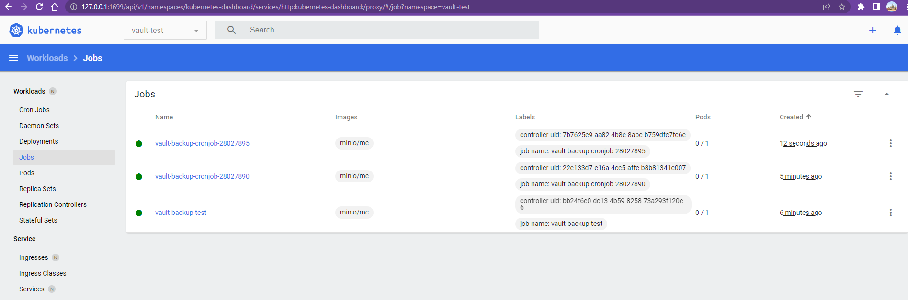
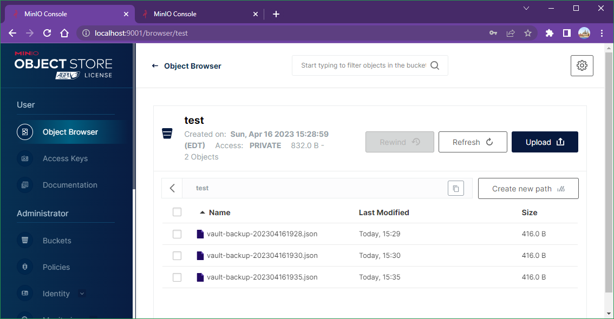

# Lab 012: Backup Vault to Minio with a cronjob

Windows Only

## Lab Goal

In this lab, we will deploy a helm chart with a cronjob to backup vault periodically into the Minio storage

## Prerequisites

### 1. Install and run Docker for Windows

### 2. Install Minikube for Windows

### 3. Start Minikube

`minikube start`

### 4. Install kubectl for Windows

```dos
minikube kubectl
```

Verify with `kubectl get node`

```dos
NAME       STATUS   ROLES           AGE     VERSION
minikube   Ready    control-plane   4m37s   v1.25.3
```

### 5. Install Helm for Windows

```dos
choco install kubernetes-helm
```

## Steps

### 1. Enable Minikube Dashboard (Optional)

```dos
minikube dashboard
```

### 2. Add Helm Repo

```dos
helm repo add minio https://charts.min.io/
helm repo update
```

### 3. Create a namespace

Create a `minio` namespace

```dos
kubectl create ns minio

kubectl config set-context --current --namespace=minio
```

### 4. Install Minio Helm Chart

Since we are using Minikube cluster which has only 1 node, we just deploy the Minio in a test mode.

```dos
helm install --set resources.requests.memory=512Mi --set replicas=1 --set mode=standalone --set rootUser=rootuser,rootPassword=rootpass123 --generate-name --namespace=minio minio/minio --version 5.0.5
```

### 5. Update the configure file

Update the minio username and password in `vault-backup-values.yaml`

```bash
MINIO_USERNAME=$(kubectl get secret -n minio -l app=minio -o=jsonpath="{.items[0].data.rootUser}"|base64 -d)

echo "MINIO_USERNAME is $MINIO_USERNAME"

MINIO_PASSWORD=$(kubectl get secret -n minio -l app=minio -o=jsonpath="{.items[0].data.rootPassword}"|base64 -d)

echo "MINIO_PASSWORD is $MINIO_PASSWORD"
```

Check the minio service name and update the `MINIO_ADDR` env var in the `vault-backup-values.yaml` file.

```bash
MINIO_SERVICE_NAME=$(kubectl get svc -n minio -o=jsonpath={.items[0].metadata.name})

echo Minio service name is $MINIO_SERVICE_NAME
```

### 6. Create a Bucket in the Minio Console

In order to access the Minio console, we need to port forward it to our local.

```bash
kubectl port-forward svc/$(kubectl get svc|grep console|awk '{print $1}') 9001:9001
```

Open our browser and go to this URL [http://localhost:9001](http://localhost:9001), and login with the username/password as `rootUser`/`rootPassword` setup above.

Go to *Buckets* section in the left lane and click *Create Bucket* with a name `test`, with all other setting as default.





### 7. Install Vault Helm Chart

We are going to deploy a Vault helm chart in the Minikube cluster.

Run below commands to apply the helm chart:

```dos
helm repo add hashicorp https://helm.releases.hashicorp.com

kubectl create ns vault-test

kubectl config set-context --current --namespace=vault-test

helm -n vault-test install vault hashicorp/vault -f vault-values.yaml
```

Wait a few minutes to make sure `vault-0` pod to be ready (Running)

```dos
kubectl -n vault-test get pod
```

Initiate the Vault

```dos
kubectl -n vault-test exec vault-0 -- vault operator init

kubectl -n vault-test exec vault-0 -- vault operator unseal <unseal key from .vault.key>
kubectl -n vault-test exec vault-0 -- vault operator unseal <unseal key from .vault.key>
kubectl -n vault-test exec vault-0 -- vault operator unseal <unseal key from .vault.key>

# Enable secrets engine and import config

kubectl -n vault-test exec vault-0 -- vault login <root token>

kubectl -n vault-test exec vault-0 -- vault secrets enable -version=2 kv-v2 

kubectl -n vault-test exec vault-0 -- vault kv put -mount=kv-v2 devops-secret username=root password=changeme

# Enable approle engine and create role/secret

kubectl -n vault-test exec -it vault-0 -- sh

cd /tmp

cat > policy.hcl  <<EOF
path "kv-v2/*" {
  capabilities = ["create", "update","read"]
}
EOF

vault policy write first-policy policy.hcl

vault policy list

vault policy read first-policy

vault auth enable approle

vault write auth/approle/role/first-role \
    secret_id_ttl=10000m \
    token_num_uses=10 \
    token_ttl=20000m \
    token_max_ttl=30000m \
    secret_id_num_uses=40 \
    token_policies=first-policy

export ROLE_ID="$(vault read -field=role_id auth/approle/role/first-role/role-id)"

echo Role_ID is $ROLE_ID

export SECRET_ID="$(vault write -f -field=secret_id auth/approle/role/first-role/secret-id)"

echo SECRET_ID is $SECRET_ID
```

Update the `VAULT_APPROLE_ROLE_ID` and `VAULT_APPROLE_SECRET_ID` variables in the `vault-backup-values.yaml` file.

### 8. Deploy the configmap

```dos
kubectl -n vault-test create configmap upload --from-file=upload.sh
```

<!--
### 9. Verify the configmap and fix the issues if needed

May have to manually update `\r\n` to `\n'.


-->

### 9. Deploy Vault Backup Helm Chart

```dos
helm -n vault-test upgrade --install vault-backup helm-chart -f vault-backup-values.yaml

kubectl -n vault-test create job vault-backup-test --from=cronjob/vault-backup-cronjob
```

### 10. Verification

<http://localhost:9001/browser/test>




